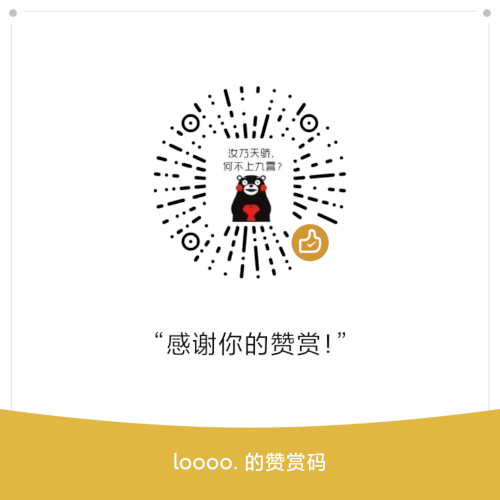

# Seq2Seq中英翻译程序

---

## 文件结构

```text
- checkpoints/ 训练过程中的检查点
- data/ 训练及验证数据
- models/ 训练好的模型放在这个文件夹下。验证程序会自动加载最新的模型

- config.py 配置文件，可以在里面更改训练及验证的配置
- main.py 主文件，启动它之后，即可在10086端口运行一个后端程序
- model.py 模型定义文件
- train.py 训练脚本
- evaluate.py 验证脚本
- utils.py 放置了一些工具函数
```

## 安装依赖

本程序默认安装使用cpu版本的pytorch。如需使用支持cuda版本的，请自行安装。

```shell
pip3 install -r requirements.txt
```

## 启动训练

```shell
python3 train.py
```

## 启动服务端

在启动服务端之前，请确认`models/`文件夹下已经有encoder和decoder模型。

```shell
python3 main.py
```

服务端启动后，请通过以下地址来访问，即可启动翻译：

```text
http://127.0.0.1:10086/seq2seq/要翻译的中文文本
```

### 成功示例

翻译成功时，返回Http状态码200, status=0

请求地址：
```text
http://0.0.0.0:10086/seq2seq/我非常高兴
```

结果：
```text
{"result":"i'm very happy . ","status":0}
```

### 失败示例

当输入的词语在字典中不存在时，将会返回Http状态码500, status=-1

请求地址：
```text
http://0.0.0.0:10086/seq2seq/崩溃了
```

返回内容：
```text
{"status":-1,"result":"Error occurred when translating."}
```

## Docker部署

您可以通过以下方式快速地构建docker镜像：

```shell
docker build -t seq2seq:v0.1 .
```

通过以下命令启动容器：

```shell
docker-compose up -d .
```

然后服务端将会运行在本机的地址：`172.110.2.2:10086`上. 若您需要将容器映射到主机的端口，请自行修改`docker-compose.yml`文件。

## 赞赏

如果这个项目帮助到你，不妨微信扫码请我喝杯咖啡吧！

